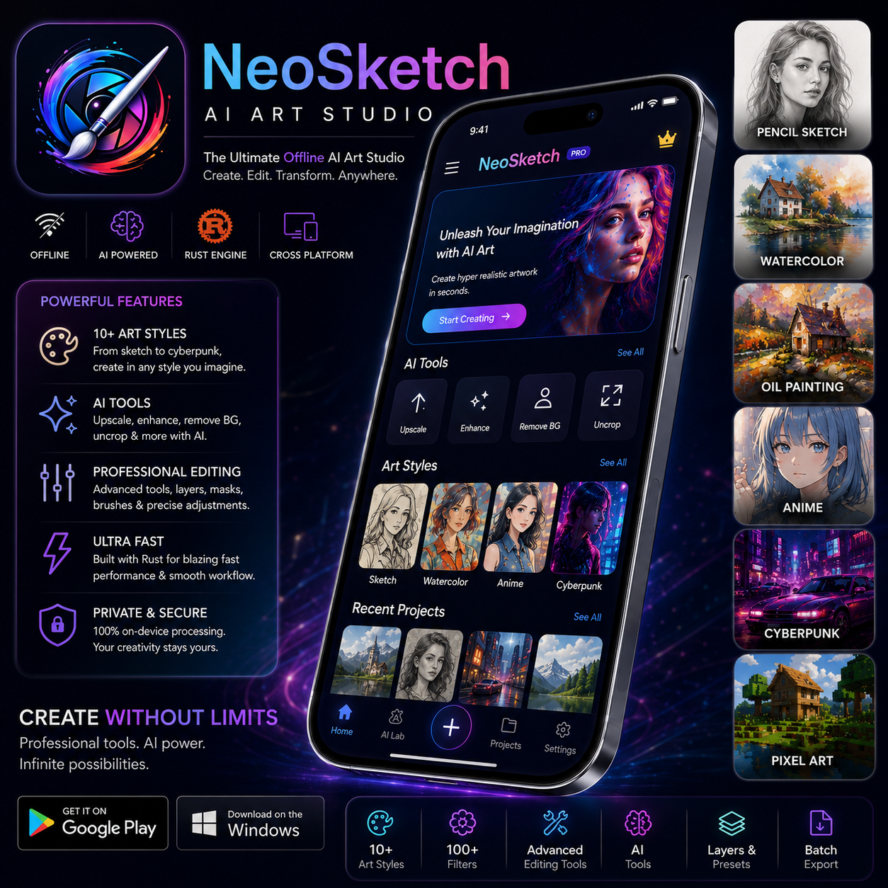

<div align="center">

</div>

# ◈ NeoSketch

### _Offline AI Art Studio. No Cloud. No Compromise._

<br/>


<br/>

> **NeoSketch** is a lightweight, fully offline AI-powered artistic photo editor built for Android and Windows.  
> Flutter frontend. Rust engine. Python AI tooling. Zero cloud dependency.  
> Professional artistic transformations — running entirely on your device.

<br/>

---

</div>

## ◈ Why NeoSketch?

Most AI photo editors push everything to the cloud — your images, your data, your privacy. NeoSketch doesn't.

| Principle | What it means |
|---|---|
| 🔒 **Offline-First** | All AI processing runs on-device. No internet required |
| 🧠 **Privacy-Focused** | Your images never leave your phone or PC |
| ⚡ **Rust-Powered Engine** | High-performance backend built in Rust for raw speed |
| 🎨 **Hyper-Realistic Art** | Real artistic rendering, not cheap Instagram filters |
| 🪶 **Lightweight** | Optimized for low RAM, small APK, fast launch |
| 🖥️ **Cross-Platform** | Android + Windows from a single codebase |
| 🔧 **Modular Architecture** | Every component is pluggable and extendable |
| 🤖 **AI-Enhanced** | ONNX + TFLite models for real on-device AI inference |

<br/>

---

## ◈ Features

### 🖼️ Core Features
- Offline AI artistic photo editor
- Real-time preview rendering
- GPU-aware optimization
- Project autosave system
- Preset management system
- Unlimited undo / redo
- Layer editing support
- Drag-and-drop image import
- Batch export
- Keyboard shortcuts (Windows)
- Touch gesture support (Android)
- Responsive adaptive UI

### 🎨 Artistic Styles
```
Pencil Sketch    │  Charcoal Sketch  │  Ink Art
Watercolor       │  Oil Painting     │  Anime
Manga            │  Comic            │  Cyberpunk
Pixel Art        │  Pop Art          │  Vintage
Clay Style       │  Neon Art         │  AI Stylization
+ more advanced styles in roadmap
```

### 🤖 AI Features
- AI Upscale & Super Resolution
- AI Detail Enhancement
- AI Portrait Enhancement
- Background Removal
- Object Removal
- AI Colorization
- AI Denoising
- AI Style Transfer
- Uncrop / Outpainting
- AI Texture Enhancement

### 🛠️ Editing Tools
```
Crop  │  Resize  │  Rotate  │  Flip  │  Perspective Correction
Brightness  │  Contrast  │  Saturation  │  Blur  │  Sharpen
Brush Controls  │  Gradient Controls  │  Texture Overlays
```

<br/>

---

## ◈ Tech Stack

### Architecture Overview

```
┌─────────────────────────────────────────────────────────┐
│                    Flutter UI (Dart)                     │
│              Riverpod State │ GoRouter Navigation        │
└────────────────────┬────────────────────────────────────┘
                     │ flutter_rust_bridge (FFI)
┌────────────────────▼────────────────────────────────────┐
│                   Rust Engine                            │
│         rayon │ OpenCV-Rust │ image-rs │ FFI             │
└────────────────────┬────────────────────────────────────┘
                     │ Model Inference
┌────────────────────▼────────────────────────────────────┐
│             ONNX Runtime │ TensorFlow Lite               │
│                  On-Device AI Models                     │
└────────────────────┬────────────────────────────────────┘
                     │ Refined Output
┌────────────────────▼────────────────────────────────────┐
│             Rust Post-Processing & Refinement            │
└────────────────────┬────────────────────────────────────┘
                     │
┌────────────────────▼────────────────────────────────────┐
│               Flutter Preview & Export                   │
└─────────────────────────────────────────────────────────┘
```

### Stack Breakdown

| Layer | Technology |
|---|---|
| **Frontend** | Flutter, Dart, Riverpod, GoRouter |
| **Backend Engine** | Rust, flutter_rust_bridge, FFI, rayon, OpenCV-Rust, image-rs |
| **AI Runtime** | ONNX Runtime, TensorFlow Lite |
| **Python AI Tooling** | PyTorch, OpenCV, Diffusers, Pillow, NumPy, TensorFlow, Scikit-image |
| **Storage** | Isar Database, Local project storage, Cached thumbnails, Model storage |

<br/>

---

## ◈ Project Structure

```
NeoSketch/
│
├── lib/                        # Flutter frontend
│   ├── core/                   # App config, themes, constants
│   ├── features/               # Feature modules (editor, ai_lab, export)
│   ├── shared/                 # Shared widgets and utilities
│   └── main.dart
│
├── rust/                       # Rust engine
│   ├── src/
│   │   ├── engine/             # Core rendering engine
│   │   ├── filters/            # Artistic filter implementations
│   │   ├── ai/                 # ONNX/TFLite inference bridge
│   │   └── lib.rs
│   └── Cargo.toml
│
├── python/                     # Python AI tooling
│   ├── model_export/           # Export PyTorch → ONNX/TFLite
│   ├── training/               # Model training scripts
│   ├── preprocessing/          # Dataset prep utilities
│   └── requirements.txt
│
├── assets/
│   ├── models/                 # Bundled ONNX / TFLite models
│   ├── presets/                # Default artistic presets
│   └── icons/
│
└── shared/                     # Shared utilities and configs
```

<br/>

---

## ◈ Performance Goals

| Target | Goal |
|---|---|
| UI Frame Rate | 60 FPS stable |
| RAM Usage | Low, optimized per device class |
| Rendering | Fully async, non-blocking |
| GPU | GPU-aware optimization where available |
| Processing | 100% offline |
| APK Size | Lightweight, minimal bloat |
| Rendering Threads | Multithreaded via Rust rayon |
| Model Loading | Efficient cached inference |

<br/>

---

## ◈ Screenshots

> _Screenshots will be added after first stable build_

| Screen | Preview |
|---|---|
| Home Dashboard | `[placeholder]` |
| Editor View | `[placeholder]` |
| AI Lab | `[placeholder]` |
| Sketch Mode | `[placeholder]` |
| Watercolor Mode | `[placeholder]` |
| Anime Mode | `[placeholder]` |
| Export Screen | `[placeholder]` |
| Desktop Workspace | `[placeholder]` |

<br/>

---

## ◈ Installation & Setup

### Prerequisites

- Flutter SDK `>=3.0.0`
- Rust `>=1.75` (stable)
- Python `>=3.10`
- Android SDK / NDK (for Android build)
- ONNX Runtime

---

### 1. Clone the Repo

```bash
git clone https://github.com/Tcode-Motion/NeoSketch.git
cd NeoSketch
```

### 2. Flutter Setup

```bash
flutter pub get
```

### 3. Rust Engine Setup

```bash
cd rust
cargo build --release
cd ..
```

### 4. Python AI Tooling Setup

```bash
cd python
pip install -r requirements.txt
cd ..
```

### 5. ONNX Runtime Setup

```bash
# Download and place models in assets/models/
# See python/model_export/ for export scripts
python python/model_export/export_all.py
```

### 6. Run — Android

```bash
flutter run -d android
```

### 7. Run — Windows

```bash
flutter run -d windows
```

<br/>

---

## ◈ Roadmap

| Phase | Feature | Status |
|---|---|---|
| v1.0 | Core editor + 10 artistic styles | 🔨 In Progress |
| v1.1 | AI Upscale + Background Removal | 📋 Planned |
| v1.2 | Batch export + Preset system | 📋 Planned |
| v2.0 | AI Video Filters | 🔮 Future |
| v2.0 | Live Camera Effects | 🔮 Future |
| v2.1 | Plugin Marketplace | 🔮 Future |
| v2.2 | Community Presets | 🔮 Future |
| v2.3 | Custom AI Model Downloads | 🔮 Future |
| v3.0 | macOS Support | 🔮 Future |
| v3.0 | Linux Support | 🔮 Future |

<br/>

---

## ◈ Contributing

Pull requests are welcome. If you want to contribute:

- 🧩 **Modular contributions** — each filter, AI feature, and UI screen is isolated
- 🤖 **AI model optimization** — help reduce model size and improve inference speed
- 🎨 **UI improvements** — new artistic styles, better previews, new presets
- ⚡ **Performance** — Rust engine optimizations, async improvements, GPU utilization
- 🐛 **Bug fixes** — open an issue first, then PR

```bash
# Fork → Clone → Branch → PR
git checkout -b feature/your-feature-name
```

Please keep PRs focused. One feature per PR.

<br/>

---

## ◈ Design Philosophy

NeoSketch is built around a few non-negotiable principles:

- **Real artistic rendering** — no fake Instagram-style filters. Every style is designed to look like actual art
- **Human-like artistic quality** — the goal is output that looks hand-made, not AI-generated
- **Offline privacy-first** — your images, your device, your data
- **Modular architecture** — every feature is independently swappable
- **Native performance** — Rust where it matters, Flutter where it shines
- **Clean scalable codebase** — built to grow without breaking

<br/>

---

## ◈ License

```
MIT License — see LICENSE for full text
```

<br/>

---

## ◈ Credits

Built on the shoulders of giants:

- [Flutter](https://flutter.dev) — cross-platform UI framework
- [Rust](https://www.rust-lang.org) — systems-level performance engine
- [ONNX Runtime](https://onnxruntime.ai) — on-device AI inference
- [TensorFlow Lite](https://www.tensorflow.org/lite) — mobile AI runtime
- [OpenCV](https://opencv.org) — computer vision backbone
- [PyTorch](https://pytorch.org) — model training
- [Diffusers](https://github.com/huggingface/diffusers) — diffusion model tooling
- The entire open-source AI community

<br/>

---

<div align="center">

**NeoSketch** aims to become a professional offline AI creative studio —  
combining the best ideas from _Procreate_, _Photoshop_, _Prisma_, _Lightroom_,  
and _Stable Diffusion_ workflows into a single lightweight cross-platform experience.

<br/>

_Built solo. Shipped with intention._

**[Tcode-Motion](https://github.com/Tcode-Motion)**

<br/>

`◈ Dark by default. Offline by design. Powerful by choice.`

</div>
